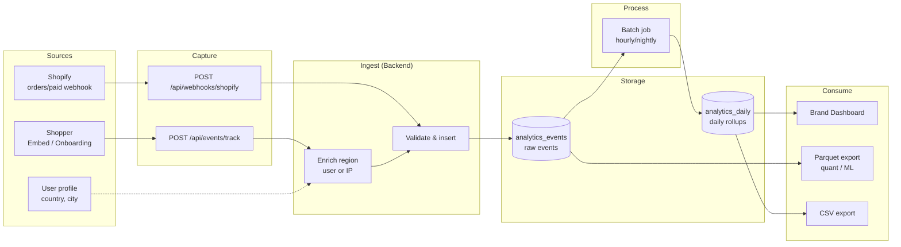
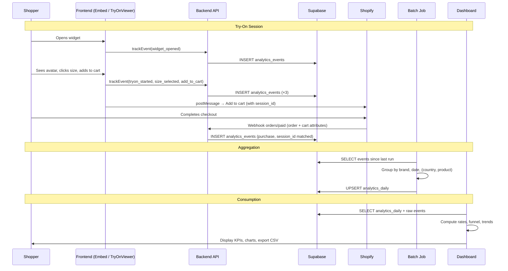
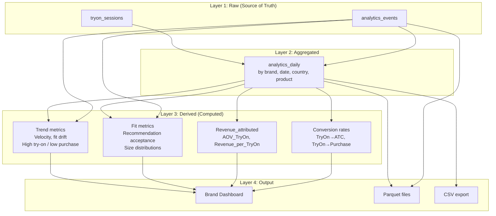
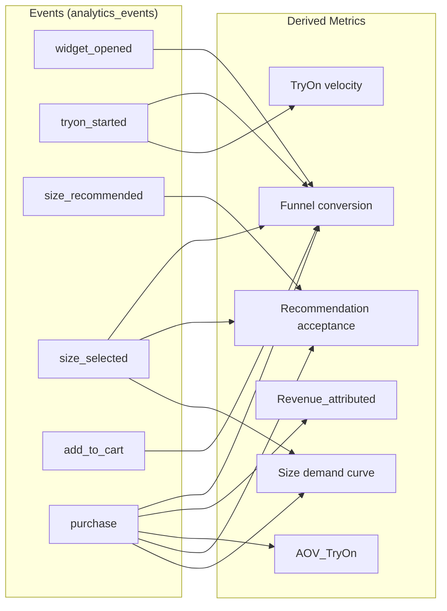

# TryOn Data Flow — Summary & Visualization

**Purpose:** Clear summary and visualization of how data flows from shopper actions to analytics outputs.

---

## In 5th Grader Language

**Imagine you're playing a video game, and the game counts everything you do.**

1. **You do stuff.** You open the Try-On, pick a size, add a shirt to the cart, or buy it. Every time you do one of these things, the game "taps us on the shoulder" and says, "Hey, the shopper just did this!"

2. **We write it down.** Our computer gets that tap and writes it in a big notebook (the `analytics_events` table). It also remembers where you're from (country, city) so we know if people in Paris like different sizes than people in New York.

3. **When you buy something.** You don't buy on our site — you buy on the store's site (Shopify). When you pay, their computer tells ours: "Someone just bought something, and we think it was from a Try-On session." We match it up and add "purchase" to our notebook.

4. **We add up the numbers.** Every night (or every hour), a robot looks at our notebook and makes a shorter summary: "Today: 100 people tried on, 20 added to cart, 5 bought." That goes into a different notebook (`analytics_daily`).

5. **We show the store.** The brand (the store) opens a dashboard. It's like a report card: "Here's how many people tried on, how many bought, what sizes they liked, and where they're from." They can also download a spreadsheet (CSV) or we save files for number-crunchers (Parquet).

**Bottom line:** You try on clothes → we count it → we add it up → the store sees how well it's working. The store gets happier because they know the Try-On is helping people buy more and choose the right size.

---

## Summary

**End-to-end flow:** Shopper interacts with TryOn (or avatar onboarding) → frontend fires events to our API → backend enriches with region, writes to `analytics_events` → batch job aggregates into `analytics_daily` → dashboard and quant tools consume. Purchases arrive via Shopify webhook and join the same pipeline.

| Stage | What happens | Output |
|-------|--------------|--------|
| **1. Capture** | Shopper clicks, views, adds to cart; embed/onboarding call `trackEvent()` | HTTP POST to `/api/events/track` |
| **2. Ingest** | Backend adds `country`/`city` (user or IP), validates, inserts | Row in `analytics_events` |
| **3. Purchase** | Shopify sends `orders/paid` webhook; we match `session_id` from cart | `purchase` event in `analytics_events` |
| **4. Aggregate** | Nightly/hourly job reads events, groups by day/brand/region/product | Rows in `analytics_daily` |
| **5. Derive** | Dashboard + APIs compute rates, funnel, trends from daily + raw | Metrics (ROI, conversion, fit, velocity) |
| **6. Export** | Batch export to Parquet; dashboard "Export" to CSV | Quant files; brand downloads |

**Key principle:** Raw events = source of truth. Daily aggregates = performance layer. Derived metrics = computed at read time (or cached).

---

## Visualization 1 — High-Level Flow

---

## Visualization 2 — Event Journey (Sequence)

---

## Visualization 3 — Data Layers

---

## Visualization 4 — Event → Metric Mapping

---

## Quick Reference: What Flows Where

| Source | Destination | When |
|--------|-------------|------|
| Shopper action (embed/onboarding) | `POST /api/events/track` | Real-time |
| Backend + user profile / IP | `analytics_events` | On each track |
| Shopify webhook | `analytics_events` (purchase) | On order paid |
| `analytics_events` | `analytics_daily` | Batch (hourly/nightly) |
| `analytics_daily` + `analytics_events` | Dashboard API | On load / filter |
| `analytics_events` + `analytics_daily` | Parquet files | Batch export |
| Dashboard | CSV | On "Export" click |

---

---

## Reference: Categories, Variables, Data Points & Dashboard

### Categories We Track

| Category | Goal |
|----------|------|
| **A. ROI & Attribution** | Does TryOn drive revenue? How much? |
| **B. Fit Accuracy & Buying** | Which sizes to buy? Is our recommendation good? |
| **C. Trend & Demand** | What's changing? Early warnings for buying teams? |

---

### Variables per Category

| Category | Raw variables | Derived variables |
|----------|---------------|-------------------|
| **A. ROI** | `user_id`, `session_id`, `order_id`, `product_id`, `brand_id`, `event_type`, `amount`, `created_at`, `country`, `city` | TryOn→ATC rate, TryOn→Purchase rate, Purchase_with_TryOn, Revenue_attributed, AOV_TryOn, Revenue_per_TryOn, Time_to_Purchase |
| **B. Fit** | `size` (recommended/viewed/selected/purchased), `sizes_viewed[]`, `product_id`, body measurements (aggregated), `country`, `city` | Recommendation match, Acceptance rate, Size demand distribution, Exploration entropy, Regional fit curves |
| **C. Trend** | `tryons_started`, `unique_sessions`, `created_at`, `date`, `product_id`, `country`, size interactions | TryOn velocity, Purchase velocity, High try-on/low purchase SKUs, Size stress, Fit drift, Regional divergence |

---

### Data Points (Raw Events)

| Event | When fired | Key data |
|-------|------------|----------|
| `widget_opened` | User opens Try-On | session_id, product_id |
| `tryon_started` | Viewer loads, user sees avatar+garment | session_id, product_id |
| `size_recommended` | We compute recommended size | size |
| `size_viewed` | User clicks a size to view | size |
| `size_selected` | User picks size (e.g. for ATC) | size |
| `add_to_cart` | User clicks Add to Cart | product_id, variant_id, size |
| `purchase` | Order paid (webhook) | order_id, amount, currency |
| `avatar_created` | Avatar creation succeeds | user_id |

*Plus context on every event: `user_id`, `session_id`, `brand_id`/`shop_domain`, `product_id`, `country`, `city`, `created_at`.*

---

### What We Show on the Dashboard

**Time filter:** Today | WTD | MTD | QTD | YTD (all charts respect it)

**KPI cards:**
- Avatars created *(we use; brand may not see)*
- Try-ons started
- Add-to-carts
- Purchases (attributed to widget)
- Revenue
- Conversion rate (purchases / tryons_started)
- Add-to-cart rate

**Charts:**
- **Funnel** — widget_opened → tryon_started → size_selected → add_to_cart → purchase (counts + % per step)
- **Trends over time** — daily line chart of revenue, purchases, try-ons, add-to-carts
- **Sizing** — bar chart of size_recommended / size_selected / size_purchased distribution
- **Products** — table of top products by try-ons, ATC, purchases
- **Region** — metrics by country (and city); map or table

**Filters:** Time preset, brand (when multi-brand), region (country/city)

**Export:** CSV of current view

**We use vs Brand gets:** We see avatar failures, viewer errors, full drop-off. Brand sees only: try-ons, sizes, ATC, purchases, revenue, conversion, products, region — no internal platform issues.

---

*See also: [QUANT_DATA_STRATEGY.md](./QUANT_DATA_STRATEGY.md) for variable categorization and derived metrics; [IMPLEMENTATION_PLAN_WHEN_BACK.md](./IMPLEMENTATION_PLAN_WHEN_BACK.md) for tracking spec and event wiring.*
